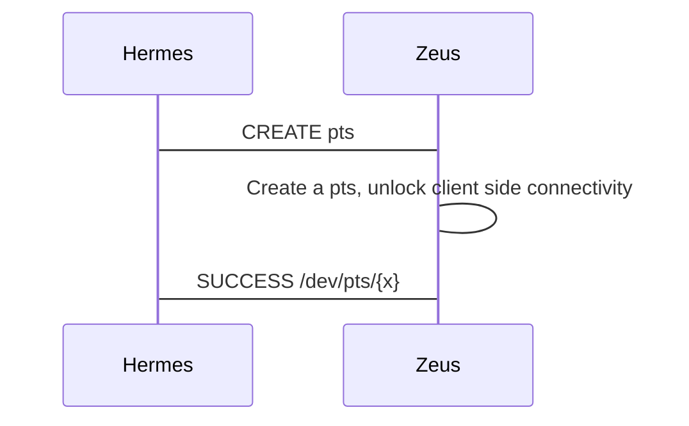
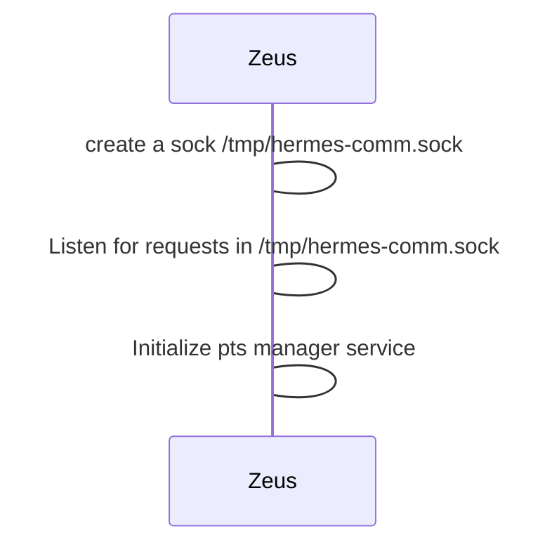
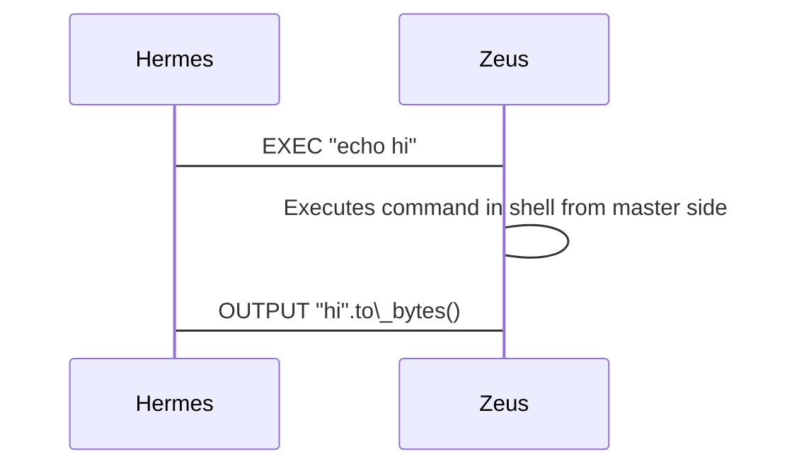
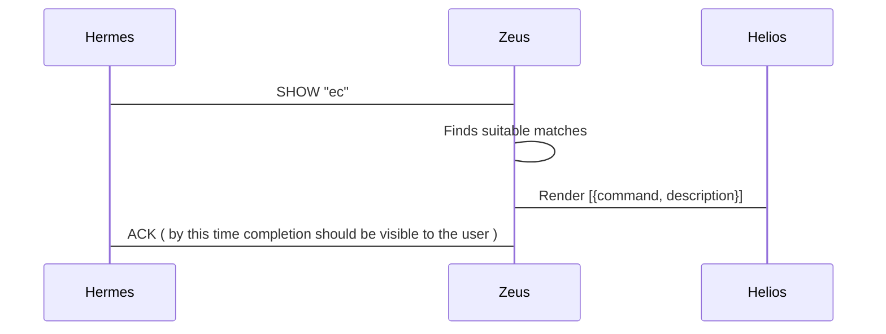

# Zeus

Lifecycle of zeus master starts with listening to a socket for creation of psuedo terminal
Zeus in turn creates a psuedo terminal device, prepares it so that client can connect to it and then responds to the request with the path of the psuedo terminal

### Following is the sequence diagram for the same

### Zeus startup actions

---
### Post /dev/pts/{x} creation
Once the pts is created, non of the communication between hermes and master will happen through the raw `*.sock` socket due to security measures

Client can send a set of commands that is understood by the master and will except a ack/response for the command sent

Following is the list of commands that is understood by Master

| Command | Argument | Initiator | Handler |
| ------- | -------- | --------- | ------- |
| **EXEC**    | $SHELL\_COMMAND | Hermes | Zeus |
| **SHOW_COMPLETIONS**    | $PARTIAL\_COMMAND | Hermes | Zeus |
| **COMMAND_SELECTED** | $USER\_CHOSEN\_COMMAND | Zeus | Hermes |
| **OUTPUT** | $BYTES | Zeus | Hermes |
| **TODO: Add More** | X | X | X |

#### Sequence diagram for EXEC

#### Sequence diagram for SHOW\_COMPLETIONS

